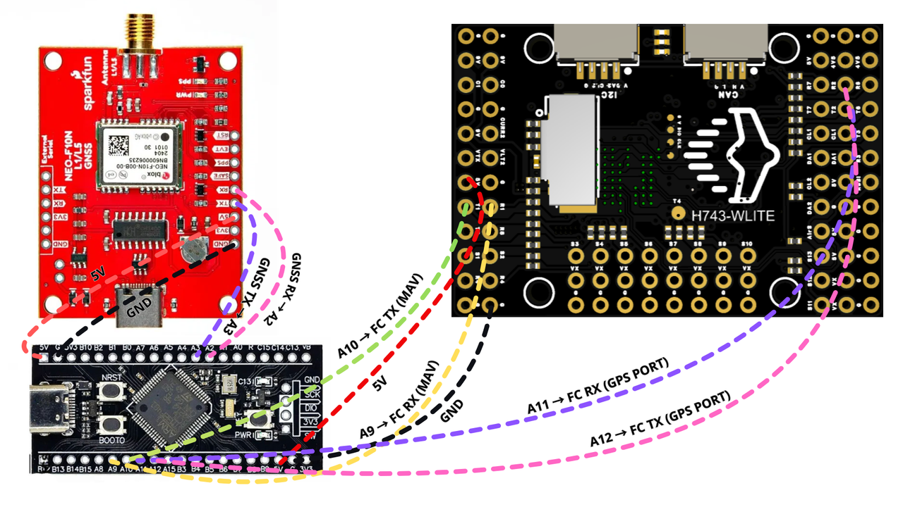
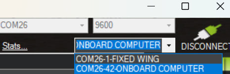
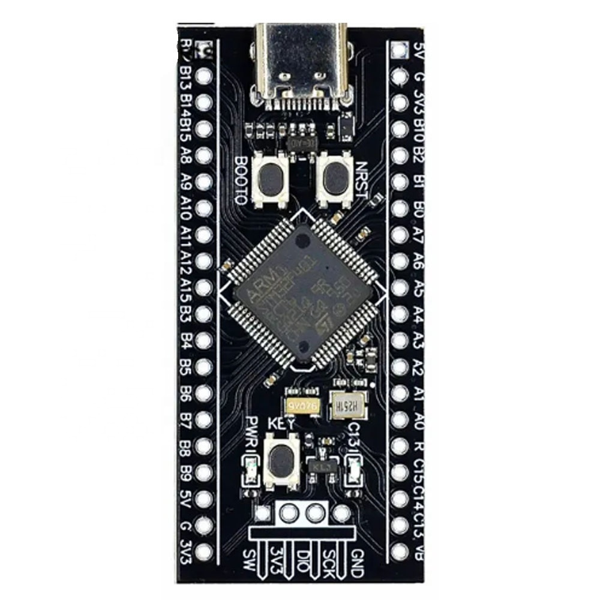
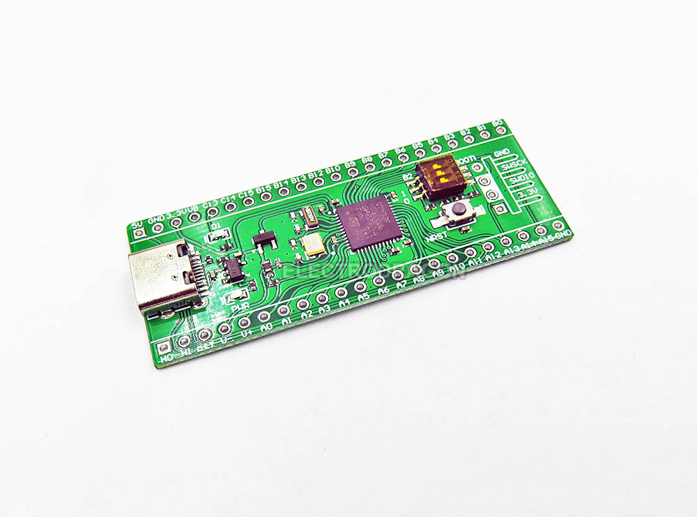

# Wiring Guide (STM32F401 BlackPill)

This firmware expects **three UART links** on the STM32:

1. GNSS and STM32 (bidirectional, UBX input for parsing)
2. FC MAVLink and STM32 (bidirectional, control/status/tuning)
3. FC GPS and STM32 (bidirectional, raw UBX forwarding to the FC GPS UART)

## Pin Map (current firmware)

| Function | STM32 Pin | Connect To |
|---|---|---|
| GNSS RX | `A3` | GNSS TX |
| GNSS TX | `A2` | GNSS RX |
| FC MAV RX | `A10` | FC MAV TX (telemetry port) |
| FC MAV TX | `A9` | FC MAV RX (telemetry port) |
| FC GPS RX | `A12` | FC GPS TX (FC GPS UART) |
| FC GPS TX | `A11` | FC GPS RX (FC GPS UART) |
| DR1 event output | `B5` | Optional external logic input |

## Signal Direction (TX -> RX)

- GNSS **TX** -> STM32 `A3` (GNSS RX in firmware).
- GNSS **RX** <- STM32 `A2` (GNSS TX in firmware).
- FC MAV **TX** -> STM32 `A10` (MAV RX).
- FC MAV **RX** <- STM32 `A9` (MAV TX).
- FC GPS **TX** -> STM32 `A12` (GPS RX).
- FC GPS **RX** <- STM32 `A11` (GPS TX).

## Diagrams

## Board Photos (reference)

These are two common BlackPill STM32F401 variants. Pin labels and functions are the same.

If GNSS or MAVLink does not work after wiring, see `03_wiring_debug.md`.

Also connect:

- `GND` (STM32) to GNSS GND and FC GND (common ground required).
- Power rails per your hardware design (GNSS module and FC are not powered from UART pins).

## Important Notes

- UART wiring must be **crossed** (`TX to RX`, `RX to TX`).
- `A11/A12` are USB D-/D+ pins on BlackPill; using them as UART means you should treat that USB function as repurposed.
- Runtime GNSS TX/RX swap is not supported on STM32F401 in this firmware. If GNSS TX/RX are reversed, fix physical wiring (GNSS TX -> `A3`, GNSS RX -> `A2`).

## DR1 Event Pulse (`B5`)

- On each DR0 to DR1 transition, the firmware drives `B5` high for 3 seconds, then low.
- Logic polarity is fixed by firmware; confirm the current behavior during first power-up.
