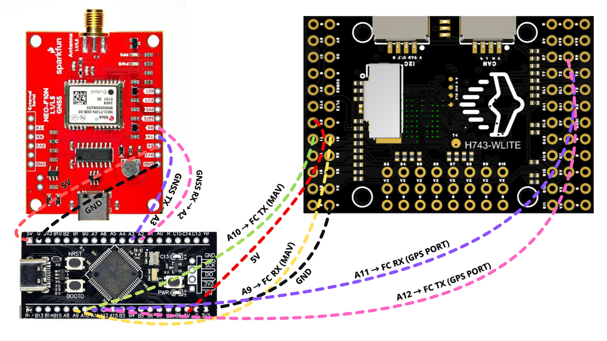
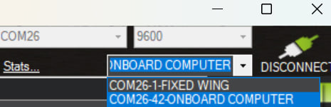
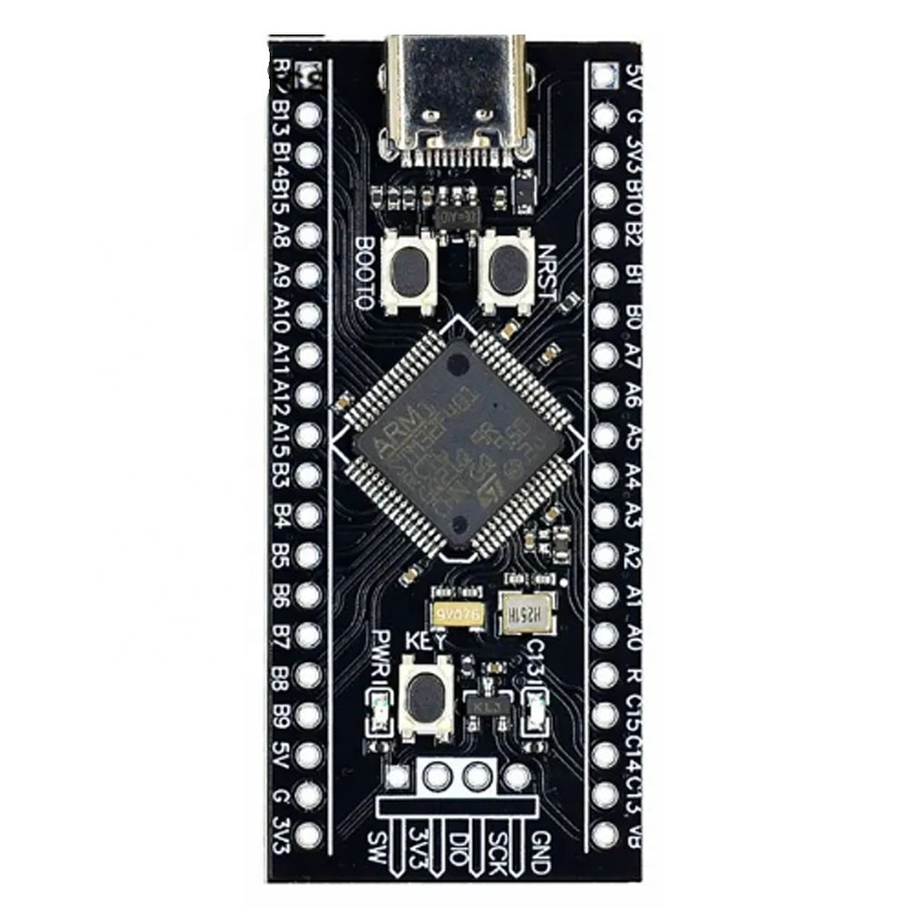

# Wiring Guide (STM32F401 BlackPill)

> Board store: [GPS Spoofing Filter](https://airdroper.org/products/gps-spoofing-filter)

This firmware uses three UART links on STM32F401:

1. GNSS <-> STM32 (receiver parsing)
2. FC MAVLink <-> STM32 (control/status/tuning)
3. FC GPS <-> STM32 (raw GNSS forwarding to FC GPS UART)

Video tutorial: [General Wiring Overview](12_video_tutorials.md#wiring).

Board silk labels are `A2`, `A3`, `A9`, `A10`, `A11`, `A12`, `B5`.

## RX/TX rule (read first)

Always cross UART lines:

- `TX -> RX`
- `RX -> TX`

Never wire `TX -> TX` or `RX -> RX`.

## STM32F401 pin map (from STM32 point of view)

Use this rule only:
- If STM32 pin is **RX**, connect it to external **TX**.
- If STM32 pin is **TX**, connect it to external **RX**.

| STM32 pin | STM32 direction | Connect this pin to |
|---|---|---|
| `A3` | **RX** (GNSS UART in) | GNSS module **TX** |
| `A2` | **TX** (GNSS UART out) | GNSS module **RX** |
| `A10` | **RX** (FC MAVLink in) | FC telemetry port **TX** |
| `A9` | **TX** (FC MAVLink out) | FC telemetry port **RX** |
| `A12` | **RX** (FC GPS in) | FC GPS port **TX** |
| `A11` | **TX** (FC GPS out) | FC GPS port **RX** |
| `B5` | GPIO output pulse | Optional external logic input |

## Wire-by-wire checklist

- [ ] STM32 `A3` (**RX**) -> GNSS `TX`
- [ ] STM32 `A2` (**TX**) -> GNSS `RX`
- [ ] STM32 `A10` (**RX**) -> FC MAV `TX`
- [ ] STM32 `A9` (**TX**) -> FC MAV `RX`
- [ ] STM32 `A12` (**RX**) -> FC GPS `TX`
- [ ] STM32 `A11` (**TX**) -> FC GPS `RX`
- [ ] STM32 `GND` -> GNSS `GND`
- [ ] STM32 `GND` -> FC `GND`

## Common wiring mistakes

- Wrong: GNSS `TX -> A2` (TX to TX). Correct: GNSS `TX -> A3`.
- Wrong: FC MAV `TX -> A9` (TX to TX). Correct: FC MAV `TX -> A10`.
- Wrong: FC GPS `TX -> A11` (TX to TX). Correct: FC GPS `TX -> A12`.
- Missing shared ground between STM32, GNSS, and FC.

## Diagrams

## Board photos (reference)

The recommended board is the WeAct Studio BlackPill STM32F401CC V2.0 (black PCB).

If GNSS or MAVLink does not work after wiring, see `03_wiring_debug.md`.

## Important notes

- `A11/A12` are USB D-/D+ pins on BlackPill; in this project they are **permanently repurposed as USART6** for the flight-controller GPS UART. The board has **no functional USB path** — the bootloader does not enumerate as a USB device and the application disables USB OTG_FS at every boot.
- **DO NOT plug any cable into the BlackPill's USB-C connector at any time.** Even just connecting a USB power cable applies host signaling to D-/D+ — the same physical wires as `A11/A12` — and that fights the USART6 line driver. The flight controller will report "GPS: No GPS" and EKF3 will refuse to align even though the filter logs show a healthy fix being forwarded. Power must come from the FC GPS-port +5V/+3V3 pin, or from the SWD header during initial flashing — never from a USB cable.
- To release `A11/A12` (e.g. for diagnostics), set `FCGPS_UART=0` in Mission Planner. That disables the FC GPS UART and puts `A11/A12` into input mode. Set `FCGPS_UART=1` to restore normal FC GPS UART operation.
- Runtime GNSS TX/RX swap is not supported on STM32F401 in this firmware; fix wiring physically if reversed.
- Receiver protocol mode is selected by `GNSS_TYPE`:
  - `0`: u-blox/UBX
  - `1`: UM980/UM981/UM982 NMEA
- For `GNSS_TYPE=1`, the filter expects one physical UM980 link only:
  - UM980 `COM1` -> STM32 `A2/A3`
  - the STM32 reads spoofing/SNR data from that same stream
  - the STM32 forwards that same stream to the FC GPS UART on `A11/A12`
- u-blox autoconfig behavior is controlled by `UBX_BAUD`:
  - `UBX_BAUD=0`: autoconfig enabled (default)
  - `UBX_BAUD>0`: autoconfig disabled, manual baud is used (reboot required)
- Power rails must follow your hardware design. Do not power GNSS/FC from UART pins.

## DR1 event pulse (`B5`)

- On each DR0 -> DR1 transition, firmware drives `B5` high for 3 seconds, then low.
- Verify polarity with your external circuit during first power-up.
