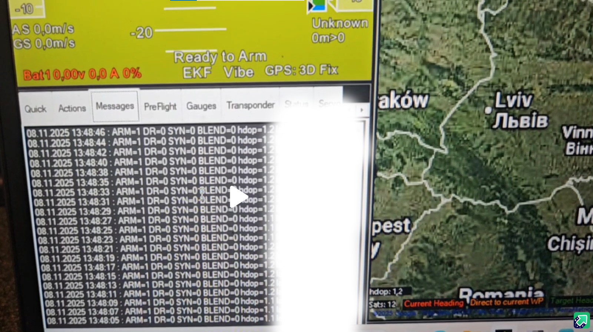

# Runtime Operation

## DR0 vs DR1

- **DR0**: normal operation. GNSS UBX is forwarded to the FC GPS UART.
- **DR1**: protection mode. GNSS forwarding to the FC GPS UART is blocked.

The SNR-spread guard can also trigger DR1 when enabled (`SNR_EN`) if the difference between the strongest and weakest satellite SNR remains abnormally narrow for the configured hold time.

This prevents suspect GNSS data from reaching the FC GPS input path while DR1 is active.

## Log Example (GCS)

The following screenshot shows the expected status-text format in the GCS message log.

## Rejoin Sequence

When rejoin conditions are satisfied:

1. The rejoin stability timer starts.
2. An optional blend phase runs for `BLEND_MS`.
3. The filter exits DR1 and restores normal forwarding (DR0).

## DR1 Event Pulse Output

- Pin: `B5` (current firmware setting).
- Behavior: high for 3 seconds on each DR0 to DR1 transition, then low.
- Use case: trigger external logger/beacon/indicator.
