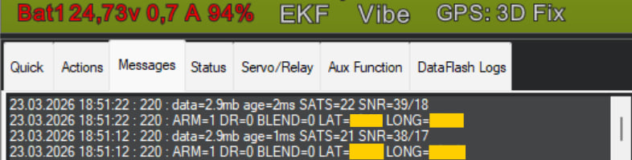

# Runtime Operation

> Board store: [GPS Spoofing Filter](https://airdroper.org/products/gps-spoofing-filter)

## DR0 vs DR1

- **DR0**: normal operation. GNSS forwarding to FC GPS UART is enabled.
- **DR1**: protection mode. Live GNSS forwarding to FC GPS UART is blocked — the FC receives silence.

This prevents suspect live GNSS data from reaching FC navigation input while DR1 is active.

**What that demands of the aircraft.** DR1 is a deliberate, sudden, clean GPS
loss, and the flight controller must be able to fly through one. On ArduPlane
that means a **used, calibrated airspeed sensor** (`ARSPD_USE=1`) and a compass
in use for yaw. The instant `Fix2` stops, EKF3 stops fusing GPS; with an
airspeed sensor in use it dead-reckons on airspeed and its wind estimate and
stays the primary estimator. Without one, EKF3 loses horizontal velocity
within seconds, `AP_AHRS` falls back to DCM, and DCM with neither GPS nor
airspeed has no centripetal correction - its attitude estimate drifts in every
turn and the autopilot "corrects" the phantom error with a real nose-down. That
is ArduPlane's designed GPS-denied behaviour, not a fault in either firmware,
and it is the failure to expect from an aircraft flown with `ARSPD_USE=0`. An
aircraft that cannot fly GPS-denied must not fly where DR1 can trip. Note that
the abrupt cut is the safe direction: a fading or blended GPS would feed the
estimator bad data, which is worse than none.

What to expect in the flight controller's log after a DR1 cut, from ArduPlane's
source. `EKF variance` will repeat: `ekf_check` reports position variance
crossing `FS_EKF_THRESH` as dead-reckoning uncertainty grows, and on a
fixed-wing it prints and does nothing else. What must *not* appear with a used
pitot is `EKF3 IMUx stopped aiding`; that means the airspeed was not being
fused. And `AHRS: DCM active` followed within seconds by `AHRS: EKF3 active`
is the DCM excursion described in the [H743 DroneCAN Guide](13_h743_dronecan.md),
removed by `AHRS_OPTIONS` bit 0 once `ARSPD_USE=1`.
`tools/analyze_dr1_transition.py` lays all of this out from a `.bin` or
`.tlog`, anchored on the filter's `GNSS BLOCKED` message.

On H743 DroneCAN firmware, replace "FC GPS UART" with DroneCAN GPS output:
`Fix2/Auxiliary` messages are published in DR0 and suppressed in DR1, while
`uavcan.protocol.NodeStatus` remains online. Spoof/fault DR1 reasons report
warning health; no-fix, low-satellite, and boot-guard suppression keep node
health `OK`. The onboard screen shows the current output gate (`PUB ON` or
`PUB BLK`) and a `WHY` reason. See the [H743 DroneCAN Guide](13_h743_dronecan.md).

## GPS Data Integrity

In normal DR0 operation, UART firmware does not rewrite GPS packets. Each byte
received from the GNSS UART is parsed for guard state and then the same byte is
forwarded to the FC GPS UART. The filter does not regenerate NMEA sentences,
does not reserialize UBX, and does not change checksums. If protection enters
DR1, forwarding is intentionally suppressed; the FC may see silence or the end
of the current receiver frame cut short at the moment of blocking.

The firmware may configure the receiver at boot. For example, the default
u-blox profile sets the receiver UART rate and message set used by the filter.
That changes what the receiver emits, but once a receiver byte reaches the
filter in DR0, the UART output path forwards that byte unchanged. The normal FC
GPS back-channel is drained for diagnostics and is not forwarded to the receiver,
so ArduPilot cannot silently change the receiver message profile through the
filter.

H743 DroneCAN mode is different because there is no FC GPS UART. It does not
tunnel raw NMEA or UBX. It converts the live receiver fix fields into native
DroneCAN `Fix2/Auxiliary` values: latitude/longitude, altitude, velocity,
satellites, DOP, and accuracy are scaled into DroneCAN units. It does not use
synthetic or blended GPS coordinates in normal operation.

The onboard status LED follows the same state shown in logs:

- **DR0**: one short blink about every 6 seconds.
- **DR1**: fast blink, about four blinks per second.

### State machine

```
                    ┌──────────────────────────────────┐
                    │                                  │
                    ▼                                  │
              ┌──────────┐    guard trip         ┌──────────┐
   boot ────► │   DR0    │ ───────────────────►  │   DR1    │
              │ (normal) │    (position jump,    │ (protect)│
              │          │     no fix, SNR,      │          │
              │ GPS      │     EKF bad, etc.)    │ GPS      │
              │ forwarded│                       │ blocked  │
              └──────────┘  ◄─────────────────── └──────────┘
                    ▲         rejoin conditions:       │
                    │         • RJ_MIN_SATS met        │
                    │         • RJ_MAX_HD met          │
                    │         • RJ_STAB_MS held        │
                    │         • DR_LOCK_MS elapsed     │
                    │         • independent evidence  │
                    │                                  │
                    └──────────────────────────────────┘
                          rejoin guard (500 ms)
                          prevents immediate re-trip
```

## DR1 trigger behavior (current firmware)

- No-fix requires at least 3 distinct invalid GNSS epochs whose first and
  latest epochs span at least 600 ms. Low satellites (`sats < 5`) uses the
  peak count from a rolling approximately 3-second window and requires 3
  distinct low-count epochs spaced at least 200 ms apart. Both remain subject
  to the startup guard.
- Position jump, altitude checks, SNR checks, and EKF checks can also trigger DR1 based on tuning.
- Both released targets default to `EKF_TRIPMS=500`. Every bad EKF category,
  including `GPS_GLITCHING` and `UNINITIALIZED` after the FC session has first
  reported healthy, requires at least 2 newly decoded `EKF_STATUS_REPORT`
  messages spanning the full configured interval. Tuning the interval to zero
  still keeps the two-report minimum; startup `UNINITIALIZED` remains exempt
  until the first healthy report.
- South-hemisphere jump: if GPS latitude goes below 0°, DR1 triggers immediately. The filter hard-blocks any south-hemisphere position from reaching the FC in normal operation (all drones operate in the northern hemisphere).
- Geo-fence violation (if `FENCE_RAD > 0`): position outside configured radius (up to 2000 km) triggers DR1.
- Heading reversal: a 150°+ change while moving > 5 m/s must be confirmed by
  3 distinct epochs, with no more than 2.5 seconds between confirmations and
  all 3 inside 5 seconds. The resulting score must then remain high through
  the outer 1.5-second confidence hold before score-only DR1 entry.
- GPS time anomaly: > 2 s drift between GPS time and the filter's internal clock triggers DR1.
- DR1 max duration (`DR1_MAXMS > 0`): automatically exits DR1 after the configured timeout, even if GNSS hasn't recovered, but only after `DR_LOCK_MS` has elapsed. Use for missions that cannot tolerate indefinite GPS blocking.

H743 DroneCAN `v0.2.0+` has no physical FC MAVLink UART, but S2/index `1`
carries the filter's MAVLink2 and returns FC telemetry. EKF-status trip,
barometric vertical-rate evidence, arm-state handling, and MAVLink
`STATUSTEXT`/`NAMED_VALUE` logging therefore continue when S2 is configured.
Camera S1/index `0` also remains active in DR0 and DR1; only native GPS
`Fix2/Auxiliary` publishing is suppressed by DR1.

### Spoofing confidence score

The firmware computes a weighted confidence score (0–100) from up to 10
detection signals. The score is visible in Mission Planner as `DR_CONF` in the
named-value telemetry and is recorded in each spoofing event log entry. Higher
values indicate more evidence of spoofing. The score adapts to available data:
unavailable protocol, target, and transport-specific rows are excluded from
the denominator.

### Confidence-signal availability

| Signal | Weight | u-blox | UM980 / Mosaic NMEA | Mosaic SBF on H743 |
|--------|--------|--------|---------------------|--------------------|
| Barometer-vs-GNSS vertical-rate divergence | 20 | H743 DroneCAN | H743 DroneCAN | Yes |
| SNR span anomaly | 20 | Yes | Yes | Yes |
| Receiver spoof verdict (`SEC-SIG`) | 25 | H743 only | No | No |
| Pseudorange residual stddev | 15 | Yes | No | No |
| SNR temporal correlation | 12 | Yes | Partial | Yes, from `MeasEpoch` C/N0 |
| Heading reversal | 12 | Yes | Yes | Yes |
| GDOP sudden change | 8 | Yes | No | No |
| GPS time sanity | 12 | Yes | Yes | Yes |
| Velocity-position consistency | 10 | Yes | Partial | Yes |
| Clock bias jump | 11 | Yes | No | Yes |

The receiver-spoof verdict is compiled only for H743 and requires a supported
u-blox receiver. The barometric vertical-rate row is compiled only in
DroneCAN builds and requires fresh FC barometer telemetry plus GNSS vertical
velocity. Pseudorange residual requires UBX `NAV-SAT`; GDOP jump requires
UBX `NAV-DOP`; and the u-blox clock row uses `NAV-CLOCK`. Velocity-position
consistency works with passive NMEA too, but is more precise with NAV-PVT NED
velocity. Mosaic SBF restores binary C/N0 temporal and clock-bias coverage;
pseudorange-residual and GDOP-jump scoring remain unavailable in Mosaic mode.

## Startup guard

- `BOOT_DLYMS` creates a startup grace window before DR/EKF trip logic can enter DR1.
- Increase `BOOT_DLYMS` if DR1 appears right after power-up and clears after reset.

## Fail-safe behaviors (watchdog, mid-flight reboot, FC link loss)

The filter is designed to survive several failure modes without operator intervention. Understanding what it does in each case helps you read logs and plan recovery.

### Hardware watchdog (IWDG: 15 s boot, 2 s runtime)

The STM32 runs an independent hardware watchdog clocked by the internal LSI
oscillator (~32 kHz). It allows **15 seconds during boot** for receiver probing
and other one-time initialization, then tightens to a **2-second runtime
deadline**. After setup, a parser path, CPU fault, stuck bus, or interrupt that
prevents the main loop from reaching its final reload point therefore forces a
reset within approximately two seconds.

When a debugger or the provisioning app halts the chip over SWD, H743 firmware v0.4.3 and newer freezes this watchdog for the debug session (DBGMCU freeze bit) so long flash operations like a full-chip erase are not reset mid-way. This has no effect in flight — the freeze only applies while a debugger holds the core halted.

Symptoms in logs:
- Unexplained `BOOT t=0ms` log line mid-flight with no user-triggered reset.
- A GNSS interruption whose total length includes the runtime deadline, reboot,
  receiver autobaud, and the applicable boot guard; do not assume a fixed
  sub-15-second recovery bound.

The 15-second boot allowance covers the worst-case receiver initialization;
the 2-second flight-time deadline begins only after setup completes. Neither
deadline is a Mission Planner parameter.

### Mid-flight reboot with FC already armed

If the filter resets while the flight controller is already armed (brownout, EMI glitch, watchdog bite during flight), the normal 20-second boot DR guard (`BOOT_DLYMS`) is automatically shortcut to **2 seconds** so GPS forwarding resumes as fast as possible. The filter learns the FC is armed by decoding the `SAFETY_ARMED` flag from the FC's `HEARTBEAT` — the first armed heartbeat after boot collapses the remaining guard.

Behavior:
- Filter resets at T=0.
- Around T≈150 ms it begins listening for MAVLink.
- First FC `HEARTBEAT` with `SAFETY_ARMED=1` arrives shortly after — typically under 1 s.
- Boot DR guard release is rewritten to `fc_armed_first_seen + 2000 ms`.
- Total worst-case blind window: roughly the autobaud time (u-blox ~2.9 s, UM980 short ~2.7 s, UM980 long ~11.5 s) plus the 2 s settle. Typical case on u-blox or UM980 short scan: under 5 s.
- A single `Boot DR guard shortcut: FC armed at boot, release in 2000ms` warning is emitted to GCS on the armed edge.

If the FC is **disarmed** at the moment of reboot (pre-flight bench test), the full `BOOT_DLYMS` window applies — this is intentional, since a cold boot on the bench shouldn't trust a first-second fix.

**The fuel total survives a reboot only when a trustworthy V2 backup-SRAM
record survives with it** (H743 DroneCAN `v0.5.28+`; V2 provenance in
`v0.5.30`). The filter trusts the record rather than the reset-cause flag, so a
valid record is restored after a watchdog bite, hard fault, brownout, or even a
POR/PDR indication. It reports `Reset in flight - fuel total kept: N g`.

POR/PDR proves only an electrical reset. It does not prove that the operator
stopped the mechanical engine or refuelled; a deep in-flight supply dip can
erase backup SRAM while the engine keeps running. Therefore **every missing,
corrupt, or legacy V1 backup record is TOTAL LOST on every boot**, including an
ordinary power-on. A surviving V2 fuel record is also invalidated when the H743
tune journal is missing, corrupt, or has no valid record: without the durable
capacity, density, and model settings, its numeric total has unknown
provenance. There is no automatic "cold boot means a fresh full tank" shortcut.

H743 DroneCAN v0.5.32 adds one narrow, explicit exception for a manually
started engine whose GPIO pulse pickup cannot report a healthy stopped zero.
ArduPilot sends the exact MAVLink pair `RPM1=-1, RPM2=-1` in that state. The
pair remains **invalid/unavailable everywhere in the normal fuel model**; it is
never globally converted to zero and it cannot clear a running-engine latch
later in the session. It can authorize a one-shot cold manual-start
declaration only when all of the following hold continuously for at least
3 seconds:

- this is a genuine cold POR after all-power removal (a valid retained backup
  may exist; it controls fuel-total provenance, not physical-stop eligibility);
- the FC has been positively identified as a supported ArduPilot family and
  version;
- the FC freshly reports **DISARMED**;
- fresh RPM messages remain exactly `-1/-1`; and
- throttle is freshly closed.

The firmware still does nothing automatically. With a LOST/unconfigured total,
readiness reports `Cold manual-start ready: write positive FUEL_CAPG`. With a
trustworthy retained total it instead reports `Cold OFF ready; write FUEL_CAPG only if refuelled`;
do not erase a surviving total merely to clear the latch.
A deliberate **positive** `FUEL_CAPG` write after a real refuel, or while
re-establishing a LOST/unconfigured total from positively known fuel aboard, is
the operator's declaration that the hand-started engine has not yet been started.
That accepted write clears only the RAM engine latch,
zeroes the fuel total, and consumes the one-shot. `FUEL_DENS` may be written
while the same cold evidence is ready, but it does not consume the one-shot;
after a real density change, wait for `Tune saved` and then write positive
`FUEL_CAPG`. Zero is rejected with `Cold FUEL_CAPG must be positive weighed fuel`.
Any armed report, any RPM at or above 1, any open-throttle
observation, or an observed FC peer/session reset permanently revokes the
one-shot for that power session. Every H743 reset restores the conservative
engine-may-be-running latch. A reset button, watchdog reset, brownout, or warm
reboot does not recreate eligibility; remove all power and satisfy the cold
conditions again.

With a lost total the filter emits **no DroneCAN ICE Status packets**:
ArduPilot's EFI backend must age stale/unhealthy instead of accepting a false
numeric total. The filter repeats `Fuel total LOST - write FUEL_CAPG to restart
it` every 60 s and mutes the warning ladder. Land or remain on the ground and
wait for either the normal fresh stopped-engine quorum (FC freshly disarmed,
RPM freshly valid and zero, throttle freshly closed) or the cold manual-start
declaration described above. Only then deliberately write a positive
`FUEL_CAPG` for the fuel actually loaded. This is
required after a normal power-on with no valid retained record **even when the
numerical `FUEL_CAPG` value has not changed**. A disarmed indication by itself
is not enough, and the write is rejected with `FUEL_CAPG blocked: engine not confirmed stopped`
until all three fresh observations agree. An accepted write zeroes the running
total and cancels any not-yet-applied 25-second charge belonging to the old
restored total. If the numerical capacity did not change, it can clear the
lost-total lockout immediately. If the capacity changed, however, the total
remains TOTAL LOST and EFI remains silent until the asynchronous tune-journal
save succeeds and reports `Tune saved`; `FUEL_CAPG written - fuel total zeroed`
alone does not prove persistence or EFI recovery. `Tune save failed` leaves the
total lost while the save remains pending for retry. A fabricated zero would
look like a full tank, which is the one thing this path must never send.

`FUEL_DENS` uses the same normal stopped-engine quorum or the ready cold
manual-start declaration. A density write does not consume the cold one-shot;
only an accepted positive `FUEL_CAPG` does. An actual density change
marks the total LOST before applying the new value, cancels any older pending
capacity commit, and keeps EFI silent. Until the verified density-journal save
succeeds, capacity writes are rejected with
`FUEL_CAPG blocked: wait for FUEL_DENS save`; a failed save stays blocked and LOST. `Tune saved` clears that
pending-density block but does not restore fuel. Only then can a subsequent
stop-authorized positive `FUEL_CAPG` write establish a fresh zero under the new
density.

A factory-reset attempt marks the fuel total LOST in backup SRAM **before** its
first flash operation can start. Even an attempt that reports storage failure
may therefore conservatively leave EFI silent. After any factory-reset attempt,
verify the complete fuel-model configuration, keep the engine stopped, and
write `FUEL_CAPG` for the fuel actually aboard; a successful changed-capacity
write still needs `Tune saved` before EFI resumes.

Every boot also begins with the conservative assumption that the engine may be
running. Normally only fresh disarmed state together with fresh valid zero RPM
and fresh closed throttle clears that latch. The sole exception is the
explicit positive `FUEL_CAPG` declaration in the one-shot cold manual-start
window above; an ordinary write, an unavailable RPM sentinel after the engine
has run, and link silence do not clear it. When a valid V2 record is
restored, the firmware adds a fixed **25-second rated-power reset-gap charge**.
That bound covers up to 2 seconds of backup-save staleness, the roughly
11.5-second longest UM980 setup path, other startup overhead, and margin. H743
has no Phase-C boot wait. This is a deliberately conservative bounded charge,
not proof of the exact fuel consumed. The integration clock also starts during
early backup initialization so any further receiver/setup elapsed time is
charged rather than silently discarded.

The restore is protected by a durable write-ahead marker. Immediately after a
known V2 total is copied into runtime, the retained BKPSRAM record is rewritten
as TOTAL LOST before risky setup begins. A successful boot replaces that marker
with a known record only after both the fixed 25-second charge and the first
measured interval have been integrated. If another reset happens before that
known commit completes, the next boot remains LOST and EFI stays suppressed
until normal stopped quorum or newly eligible cold authorization permits a
positive `FUEL_CAPG` write. This prevents
repeated setup resets from reusing one stale known total while charging its
unobserved time only once.

> **Never perform Phase-C maintenance while the engine is running.** The fixed
> 25-second allowance covers bounded reset/startup work, not an operator who
> leaves a maintenance session connected for an arbitrary time.

### FC MAVLink staleness (link loss fail-safe)

This applies to the physical FC telemetry UART on UART builds and to the H743
DroneCAN S2/index `1` virtual port.

The direct FC-link DR1 gate watches two safety streams: `HEARTBEAT` and
`EKF_STATUS_REPORT`. A heartbeat is stale after 3 seconds. EKF status is stale
after 4 seconds on H743 (2 seconds on direct-UART F401). If either remains
outside its freshness window for another continuous 2 seconds, the filter
enters DR1. This distinguishes a brief delayed frame from a sustained loss of
the safety link.

Other fields do not directly trip the FC-link guard. Stale `ATTITUDE` or
`VFR_HUD` freezes/removes the affected synthetic-motion evidence, and stale
`SCALED_PRESSURE` removes barometric evidence so a frozen value cannot create
a false comparison. `ALTITUDE` is not part of this path: ArduPilot has no
streamable MAVLink `ALTITUDE` message, so the firmware uses
`SCALED_PRESSURE` where barometric input is applicable. The filter does
**not** forcibly exit DR1 when the link drops.

Fuel accounting deliberately continues through this failure. Once fresh armed
state, running RPM, or an open-throttle observation establishes that the engine
may be running, silence cannot clear that latch. With RPM gone, the estimator
charges rated-power burn and keeps the cumulative total advancing. Only fresh,
explicit agreement on disarmed + zero RPM + closed throttle clears the latch.
The cold `-1/-1` declaration is no longer available once any running evidence
has appeared, so it cannot turn a failed pickup into a false stop after start.
The same update runs while an FC-version hard block is active, so a navigation
fail-closed state cannot silently freeze the fuel clock.

The trip emits `DR: FC telemetry stale (hb=... ekf=...)`; `never` identifies a
stream that has not been decoded since boot, while the numeric values show its
age in seconds.

### FC firmware identity gate

FC version is a separate publication gate, not a DR1-recovery vote. Starting in
H743 DroneCAN v0.5.30, the filter explicitly sends both a message-interval
request and `MAV_CMD_REQUEST_AUTOPILOT_CAPABILITIES` for
`AUTOPILOT_VERSION`. GNSS output is suppressed immediately while the version
is unknown, and remains suppressed for any version older than ArduPilot 4.6.1.
The 15-second grace starts only after the FC transport target exists and delays
only the repeating warning/hard processing block; it never permits GPS through.
After it expires, an unknown FC reports `FC VERSION UNKNOWN` and
`AUTOPILOT_VERSION REQUIRED`. A known old FC reports `FIRMWARE TOO OLD` and
`UPDATE TO ARDUPILOT 4.6.1+`. A peer reset/rebind clears the old version credit
and starts fail-closed again.

### DR1 maximum latch (`DR1_MAXMS`)

By default, once DR1 latches, the filter stays in DR1 until the normal rejoin gates clear — there is no time-based forced exit. If your mission profile cannot tolerate an open-ended DR1 (e.g. long-range flight where losing GPS for the whole remaining leg is worse than accepting partially-recovered GPS), set `DR1_MAXMS` to a non-zero millisecond value. Once reached, the filter force-exits DR1 and resumes forwarding even if spoof confidence is still high.

`DR1_MAXMS` cannot override `DR_LOCK_MS`: if the max timer expires first, the filter still stays in DR1 until the lock window finishes. Default `DR1_MAXMS=0` leaves the max-duration exit disabled. **Use with caution** — the default is safer for most missions.

Bench testing can use short DR lock values so you do not wait minutes between trials. After bench validation, set `DR_LOCK_MS=120000` or higher for real flights so every DR1 trigger holds protection for at least 2 minutes before any rejoin or forced-exit path can restore DR0.

## GNSS forwarding diagnostics

- `FCGPS_FWD=1` forces the FC GPS UART on and raw-forwards GNSS even in DR1, before the boot north gate, and during hemisphere-fence trips. Diagnostic bench use only.
- `FCGPS_FWD=0` is the normal anti-spoof setting.

H743 DroneCAN has no `FCGPS_FWD` raw UART bypass. To validate that path, use
DroneCAN/SLCAN tooling and the onboard screen: node ID `42` should remain
online, and GPS publishing should change between `PUB ON DR0` and `PUB BLK DR1`.

## Receiver mode

- `GNSS_TYPE=0`: u-blox/UBX mode.
- `GNSS_TYPE=1`: UM980/UM981/UM982 NMEA mode.
- `GNSS_TYPE=2`: Septentrio Mosaic X5 mode. H743 DroneCAN `v0.1.9+` accepts SBF or NMEA; UART pass-through builds use NMEA.
- `GNSS_TYPE` changes require STM32 reboot.
- In `GNSS_TYPE=1` or UART `GNSS_TYPE=2`, the STM32 expects one physical NMEA receiver stream on `A2/A3` and forwards that same stream to the FC GPS UART.
- In H743 DroneCAN `GNSS_TYPE=2`, the STM32 can parse Mosaic SBF on `A2/A3` and publish the resulting GPS over CAN.

## Log example (GCS)

The following screenshot shows expected status-text format in GCS messages.

- In Mission Planner `Messages`, these periodic STM32 filter logs normally appear about once every **10 seconds** by default.
- You typically see two back-to-back lines in the same moment:
  - GNSS summary line: `data=... fix=... nav=... SATS=... SNR=...`
  - mode/state line: `ARM=... DR=... BLEND=... LAT=... LONG=...`
- On H743 DroneCAN `v0.2.0+`, these messages use S2/index `1`; configure that
  virtual port before treating missing GCS logs as a filter fault.
- If Mission Planner shows raw parameter names while you are tuning log or SNR settings, install [AirDroper Mission Planner Mod](https://gps.airdroper.org/download/mission-planner-mod) and refresh the parameter list.
- `fix` is the age of the last valid position/altitude fix; `nav` is the age of the last valid GNSS nav-data frame seen by the filter.
- `SNR=NA` means the filter is not currently receiving usable SNR data from the receiver. With u-blox, this usually means `NAV-SAT` is not being output. With NMEA receivers such as UM980 or Mosaic X5, it means no `GSV` sentences are arriving. With H743 DroneCAN Mosaic SBF, it means `MeasEpoch` is missing, stale, or has no usable C/N0.
- On u-blox firmware v1.6.12+, persistent `SNR=NA` also emits `snrdbg n... a... l... s... g... o... b...`: NAV-SAT frames seen, frame age, last length, reported satellites, usable C/N0 satellites, oversize drops, malformed/checksum drops.
- On u-blox firmware v1.6.15+, the stale-SNR recovery command re-enables NAV-SAT through legacy `CFG-MSG` and `CFG-VALSET` on UART1/UART2 only when NAV-SAT frames are missing or stale. A recovery line such as `NAV-SAT cfg ack legacy=1 u1=1 u2=1` shows which paths the receiver ACKed.
- On u-blox firmware v1.6.16+, the recovery timer starts when SNR first goes stale, while the config rewrite still waits for NAV-SAT itself to go stale. This shortens intermittent `SNR=NA` recovery after a receiver-side NAV-SAT output change from roughly two stale windows to about one stale window.
- On u-blox firmware v1.6.18+, normal protected mode drains FC GPS back-channel bytes instead of forwarding them to the receiver, so ArduPilot auto-config writes cannot turn off `NAV-SAT`.
- On u-blox firmware v1.6.19+, if the receiver is alive but remains at `SATS=0` before DR1, the filter automatically sends a u-blox cold start plus STM32 reinit after about 2 minutes. It does not run `UBX_RESET=3` automatically. After that automatic retry it logs `If stuck: bench UBX_RESET=3`; use the bench-only recovery steps below only if acquisition still does not recover.
- On u-blox firmware v1.6.21+, if a healthy fix already exists and NAV-SAT later disappears, the first NAV-SAT re-enable runs after about 8 seconds instead of the normal 30-second stale-SNR window. Startup and no-fix cases still use the slower path.
- On u-blox firmware v1.6.22+, direct autoconfig mode (`UBX_BAUD=0`) clears/loads receiver defaults at boot, rescans the receiver baud, then applies and saves the filter's UBX profile. Manual baud mode (`UBX_BAUD>0`) skips this boot clear and leaves the receiver profile under operator/vendor control.
- If `SNR_EN=1` and `SNR=NA` persists beyond 30 seconds, a `WARNING: SNR_EN=1 but SNR=NA/stale (no fresh GSV/NAV-SAT?)` message is logged. The SNR guard cannot trip while SNR data is absent.
- If `SATS=0`, `fix=9999ms`, and `nav` is fresh, the receiver is communicating but has no valid position fix. On u-blox firmware v1.6.15+, field recovery parameter `UBX_RESET=1` hot-starts, `UBX_RESET=2` cold-starts, and `UBX_RESET=3` clears saved receiver config and reloads defaults.
- On u-blox firmware v1.6.15+, no-fix or zero-satellite states also emit `ubxpvt ...`, `ubxrf ...`, `ubxsig ...`, and `ubxgnss ...` lines. `ubxpvt` shows the receiver's NAV-PVT fix flags; `ubxrf` shows antenna power/status, RF noise, AGC, jamming state, and CW interference suppression; `ubxsig` shows explicit jamming/spoofing state when supported; `ubxgnss` shows which GNSS constellation blocks are enabled.

### u-blox no-fix recovery

If logs show `SATS=0`, `fix=9999ms`, fresh `nav`, and `ubxpvt f0 ... sv0`, the
receiver is talking but has no valid position fix. On the bench, try:

1. Set Mission Planner parameter `UBX_RESET` to `3`.
2. Wait for `UBX_RESET=3 clearing u-blox config` and `u-blox config cleared; reinit in 5s`.
3. Power-cycle the whole GPS/filter setup.
4. Test outdoors with clear sky for 10-15 minutes.
5. Keep `SNR_EN=0` until the receiver gets a stable fix again.

`UBX_RESET=3` deletes saved u-blox BBR/Flash receiver configuration. Use it only
for recovery or bench diagnostics, not as a normal flight setting. Firmware
v1.6.22+ does not run `UBX_RESET=3` automatically, but direct u-blox
autoconfig mode can automatically clear saved u-blox configuration at boot
before loading receiver defaults and writing the filter profile. Set
`UBX_BAUD>0` for custom/gateway receivers that must keep an operator or vendor
profile.



## Rejoin sequence

When rejoin conditions are satisfied:

1. Rejoin stability timer runs.
2. Optional blend phase runs for `BLEND_MS`.
3. Filter exits DR1 and restores DR0 forwarding.

## Live spoofing map in Mission Planner

H743 DroneCAN `v0.5.29+` and the
[AirDroper Mission Planner Mod](https://gps.airdroper.org/download/mission-planner-mod)
can show the receiver solution moving during DR1. The plugin adds a compact
status strip, a **Details** window, and a Flight Data map overlay:

- a **red aircraft** is the receiver-reported, untrusted GNSS position and
  trail — where the receiver claims the aircraft is, not measured physical
  truth;
- an **orange aircraft** is the filter's wind-blind DR reference estimate; it
  can drift in wind or freeze when FC speed/yaw telemetry is stale;
- a **green aircraft** is the flight controller's position estimate, also not
  ground truth;
- a **purple dashed line** is the plugin's live, provisional RF bearing
  **axis** (`bearing / bearing+180°`), not an arrow or source position;
- thin purple lines are finalized RF axes, while a purple target and dotted
  sensitivity circle are a strict three-axis advisory intersection;
- connector lines show distance and bearing from the DR/FC estimates to the
  untrusted receiver solution.

When no fresh heading is available, an aircraft becomes a non-directional dot;
the plugin never invents a north-facing heading.

The panel also shows DR0/DR1, active and latched trip reasons, confidence,
event count, stream freshness, u-blox RF/jamming diagnostics, and the live
axis fit or its reason for abstaining. It hides live markers and the RF axis
when samples go stale. Confidence is availability-normalized, so zero does not
by itself prove the signal is clean.

### Connect the two links

1. Install the Mission Planner Mod and restart Mission Planner.
2. Connect the FC normally and keep it as the primary connection.
3. Connect a second USB-C cable directly from the H743 filter to the GCS PC.
4. In Mission Planner **Connection Options**, add the H743 COM port as a
   secondary MAVLink connection at `115200`. Mission Planner performs its normal
   parameter request; no separate parameter step is needed.
5. Open Flight Data and click **Details** in the AirDroper strip. During DR1,
   require the **Private USB stream** field to begin `LIVE (private USB:` and
   name the H743 COM port before treating the red/orange points as current.

The H743 USB device identifies as VID/PID `0483:5740` and product
`AirDroper_GNSS_Filter_H743_DroneCAN`. Normal DR status can arrive through the
primary FC link, but live receiver and DR-reference coordinates are emitted only
through this private USB connection. They never enter S2, CAN, or the flight
controller path. This preserves the absolute rule that GNSS position must not
reach the FC in DR1.

Firmware v0.5.30+ deliberately accepts Mission Planner secondary connections
that leave DTR deasserted and re-enumerates CDC cleanly at boot. It also gives
USB its own MAVLink transmit sequence, separate from FC/S2, so interleaved
normal and private `SP_*` frames do not create sequence holes on either link.
The private `SP_*` feature itself was introduced in v0.5.29; the DTR and
sequence corrections begin in v0.5.30.

A direct cable is appropriate for bench work or a GCS physically tethered to
the aircraft. For untethered/long-range use, design a separate out-of-band
radio or companion path; the existing FC tunnel will not carry these positions.
Before flight, inject a moving false solution on the bench while capturing raw
CAN: USB should show the track, while CAN contains no `Fix2`, `Auxiliary`, or
private `SP_*` records.

## Finding the jammer: live and post-flight direction estimate

H743 DroneCAN `v0.5.27+` emits the RF observables needed to estimate a BEARING
to a jammer or spoofer. Mission Planner plugin `v0.3.0+` can fit them live, and
`tools/df_analyze.py` can fit the same records after the flight. **The filter
computes no bearing on board** and feeds none of this back into detection or
recovery — it only emits telemetry, and a test enforces that it can never write
filter state or trip DR1. That isolation is deliberate: a bearing that could
influence DR1 would hand an attacker a lever controlled by transmit power and
position.

**How a bearing is possible with one antenna.** It isn't, instantaneously — one
antenna is one phase centre, so there is no interferometry. The bearing comes
from MOTION. A ground emitter arrives near or below the horizon, exactly where
a patch antenna's gain rolls off and where the airframe shadows it, so received
interference power modulates with heading in a single-lobe shape whose peak
points at the emitter. Fitting that modulation over a turn recovers a bearing
to roughly ±20–45°.

Records are `NAMED_VALUE_INT`, so ArduPilot dataflash-logs them automatically.
The fit uses the heading carried in `DF_YAW`. A single fit gives no source
position or range; plugin `v0.3.0+` can separately intersect several finalized
axes under the strict gates below:

| Record | Contents |
|--------|----------|
| `DF_RF` | AGC, jamming indicator, jamming state and antenna status, bit-packed |
| `DF_NOIS` | receiver noise level |
| `DF_SNR` | max/min C/N0 and the satellite count they came from |
| `DF_YAW` | latest fresh FC heading when the RF record was emitted, in centidegrees |

The heading can be up to two seconds old; its exact age is not telemetered.
That phase error is not included in the displayed fit sigma, so sigma is not a
complete accuracy guarantee. Sampling is 1 Hz normally and 5 Hz once the
receiver reports elevated interference or DR1 latches — 1 Hz aliases the lobe
for a 20°/s turn.

### Live in Mission Planner

The normal FC telemetry link is enough for the open RF-axis estimate. The
second private USB cable is additionally required for the red/orange tracks
and the three-axis map intersection. Open the AirDroper **Details** window and
watch **Approx. jammer/spoofer axis**:

- `COLLECTING` means fewer than 20 usable RF/yaw samples have arrived;
- `ABSTAIN - turn geometry` means the aircraft has not turned enough;
- `ABSTAIN - no directional lobe` means a lobe did not beat noise and the
  fitted range trend;
- `ABSTAIN - RF metrics disagree` means the observables point in incompatible
  directions;
- `LIVE PROVISIONAL / UNVALIDATED AXIS b / b+180°` is an accepted open-segment
  fit. It can move as more samples arrive.

When an axis is accepted, Mission Planner draws a bidirectional purple dashed
line through the fixed mean of the positions that accompanied that fit. It does
not move the old bearing to the aircraft's latest position. The line is
arbitrarily 3 km long on each side and does **not** mean the emitter is at an
endpoint. Fly at least a 90° turn; a full orbit is much better. The live fitter
uses fixed segments of at most 120 seconds and starts over after a telemetry gap
longer than 10 seconds.

### Provisional three-axis intersection

The normal FC link is sufficient for the live purple axis, but a map
intersection also needs the H743 USB-C secondary link. Only its moving,
wind-blind DR reference is accepted as the position anchor. The red
receiver-reported position is attacker-controlled and is never used.

1. At one observation area, turn slowly for at least 20 seconds and collect at
   least 40 RF/yaw samples. Press **Capture qualified axis** when enabled.
2. Repeat at two more areas so **every pair** of observation anchors is at
   least 500 m apart and every pair of axis directions differs by at least 30°.
   All three axes must be finalized within 180 seconds, and the newest expires
   after 30 seconds. Choose geometry where the axes cross widely.
3. Watch **Provisional RF intersection**. Until three axes qualify it says
   `ABSTAIN - third independent finalized axis required`; every other failed
   gate also produces a specific abstention reason.
4. A qualified result draws a purple target and dotted **geometry sensitivity**
   circle. Use **Center RF intersection** to inspect it and **Reset RF axes**
   before investigating another source or incident.

The location gate is deliberately stricter than the live-axis gate: each
finalized segment needs at least 40 samples over 20–120 seconds, sigma no worse
than 15°, `F >= 8`, geometry `>= 1e-3`, two agreeing RF metrics, stable bearing,
at least 90% moving-reference coverage, and bounded yaw-age sensitivity. The
set needs the same private-USB telemetry session, DR event, and fitted metric;
three pairwise-separated anchors and directions, strong crossing geometry,
bounded range, and agreement from every retained axis. The marker disappears
immediately when freshness or any
gate fails.

The local intersection solver is limited to 70°S–70°N and abstains outside
that band; this keeps projection distortion inside the displayed sensitivity
bound.

The display is labelled **UNVALIDATED INTERFERENCE-AXIS INTERSECTION — ADVISORY
ONLY**. It assumes one stationary emitter. Its axes have uncalibrated airframe
and antenna bias, its DR anchors can drift, and its dotted circle is sensitivity
to the known fit/yaw-age geometry—not a confidence or accuracy radius. It is
not ground truth, a waypoint, or a navigation/targeting input, and nothing is
sent back to the flight controller.

### Post-flight analysis

1. Fly a **full orbit** through the interference. A straight pass will not do
   it: the fit needs heading spread, and without it the tool abstains.
2. Pull the FC's `.bin` log.
3. Run `python tools/df_analyze.py flight.bin`.

The plugin and tool fit every metric independently and refuse to show an axis
when usable metrics disagree. Two limits are worth understanding before you
act on a number:

- **Treat the result as an AXIS, not a direction, until you have confirmed it
  against a known emitter.** The AGC polarity assumption is unvalidated; if it
  is backwards, the bearing is 180° reversed at identical fit quality with
  nothing in the output to reveal it.
- **One bearing is a direction, not a position.** Although two mathematical
  lines always intersect, the live plugin requires three independent axes so a
  conflicting segment cannot silently become a plausible location.

The tool applies a geometry gate as well as a noise gate, and abstains rather
than guessing — an abstention is the correct answer to a flight that did not
turn enough.

## DR1 event pulse output

- Pin: `B5`.
- Behavior: high for 3 seconds on each DR0 -> DR1 transition, then low.
- Use case: external logger/beacon/indicator.

## GNSS recovery watchdog

The filter automatically attempts to recover a stuck GNSS receiver when no valid fix is received.

- After **15 s** without fix: hot restart is issued.
- After **45 s** without fix: cold/factory restart is issued.
- Every **120 s** after the cold restart, if still no fix: another cold restart is retried.
- All timers reset as soon as a valid fix is received.

**u-blox**: hot restart uses UBX `CFG-RST` with `navBbrMask=0x0000`; cold restart uses `navBbrMask=0xFFFF`.

**UM980/981/982**: hot restart sends `RESET\r\n` over the GNSS UART; cold/factory restart sends `FRESET\r\n`.
After `FRESET`, the STM32 waits for the receiver to boot and rescans the active GNSS baud.

**Mosaic X5 / passive NMEA**: the STM32 does not send receiver reset commands. If no fix persists, it only re-runs the passive NMEA baud scan. Use Septentrio RxTools/Web UI to reset or reconfigure the receiver.

Recovery status messages are logged to GCS (`INFO` for hot, `WARNING` for cold/retry).

## Operational checks

- If FC constantly shows `No Fix`, verify RC AUX logic is not forcing GPS disable on FC.
- If map shows jumps during spoofing, trust DR state and filter logs over map position.
- On H743 DroneCAN, also verify the screen `WHY` row and DroneCAN node status
  before debugging ArduPilot GPS parameters.
