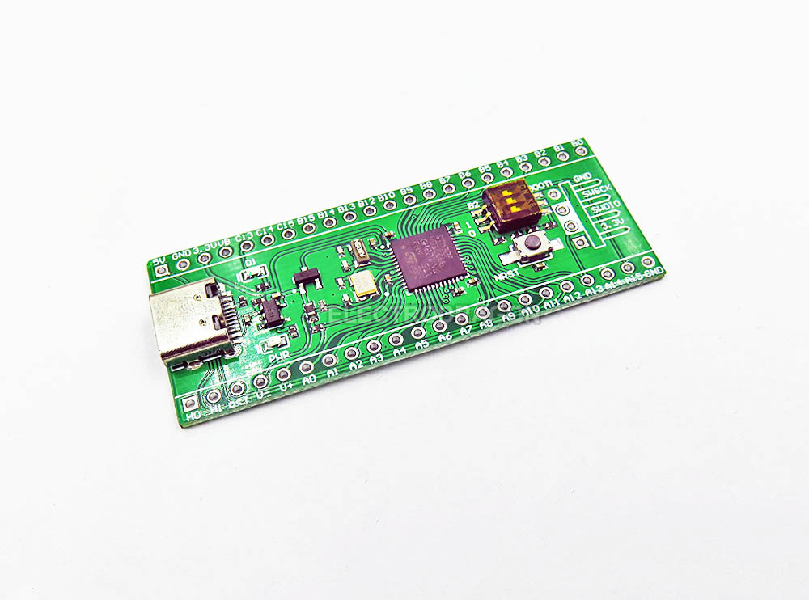

# Інструкція з підключення (STM32F401 BlackPill)

Ця прошивка очікує **три UART-з'єднання** на STM32:

1. GNSS і STM32 (двосторонній канал приймача для парсингу фільтром)
2. FC MAVLink і STM32 (двосторонній канал керування/статусу/тюнінгу)
3. FC GPS і STM32 (двостороннє пересилання «сирого» GNSS-потоку на GPS UART FC)

## Pin map (поточна прошивка)

| Функція | Пін STM32 | Підключити до |
|---|---|---|
| GNSS RX | `A3` | GNSS TX |
| GNSS TX | `A2` | GNSS RX |
| FC MAV RX | `A10` | FC MAV TX (телеметрійний порт) |
| FC MAV TX | `A9` | FC MAV RX (телеметрійний порт) |
| FC GPS RX | `A12` | FC GPS TX (GPS UART FC) |
| FC GPS TX | `A11` | FC GPS RX (GPS UART FC) |
| Вихід події DR1 | `B5` | Опційний зовнішній логічний вхід |

## Напрям сигналів (TX -> RX)

- GNSS **TX** -> STM32 `A3`.
- GNSS **RX** <- STM32 `A2`.
- FC MAV **TX** -> STM32 `A10`.
- FC MAV **RX** <- STM32 `A9`.
- FC GPS **TX** -> STM32 `A12`.
- FC GPS **RX** <- STM32 `A11`.

## Схеми

## Фото плат (довідково)

Нижче дві поширені версії BlackPill STM32F401. Підписи пінів і функції однакові.

Якщо після підключення не працює GNSS або MAVLink, дивіться `03_wiring_debug.md`.

Також підключіть:

- `GND` (STM32) до GNSS GND і FC GND (спільна земля обов'язкова).
- Живлення згідно з вашою апаратною схемою (не живіть GNSS/FC від UART-пінів).

## Важливі примітки

- UART-підключення мають бути перехресні (`TX -> RX`, `RX -> TX`).
- `A11/A12` на BlackPill фізично є USB D-/D+, у цьому проєкті вони використовуються як UART.
- Runtime-обмін GNSS TX/RX не підтримується на STM32F401 у цій прошивці; виправляйте підключення фізично.
- Режим протоколу приймача задається параметром `GNSS_TYPE`:
  - `0`: u-blox/UBX
  - `1`: UM980/UM981 NMEA
- Поведінка u-blox автоконфігу задається параметром `UBX_BAUD`:
  - `UBX_BAUD=0`: автоконфіг увімкнено (за замовчуванням).
  - `UBX_BAUD>0`: автоконфіг вимкнено, використовується ручний baud (потрібен reboot).

## Імпульс події DR1 (`B5`)

- При кожному переході DR0 -> DR1 прошивка піднімає `B5` на 3 секунди, потім опускає.
- Перевірте полярність із вашим зовнішнім колом при першому вмиканні.
