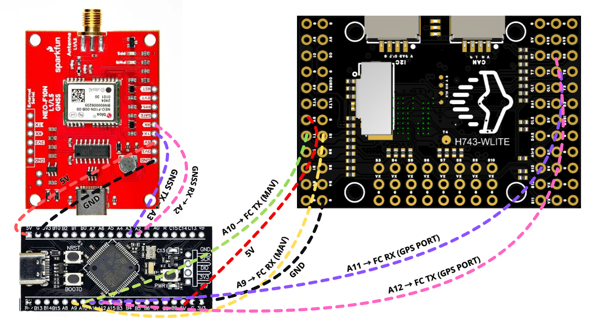
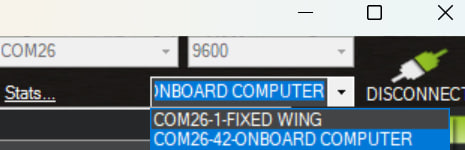
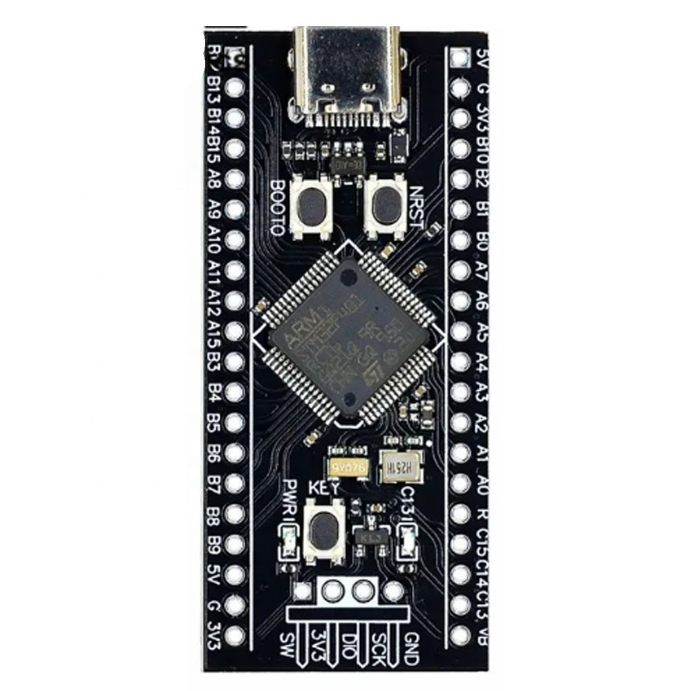

# Інструкція з підключення (STM32F401 BlackPill / WeAct H743)

> Де купити плату: [GPS Spoofing Filter](https://airdroper.org/products/gps-spoofing-filter)

UART-прошивка використовує три UART-лінії на підтримуваних STM32-платах:

1. GNSS <-> STM32 (парсинг даних приймача)
2. FC MAVLink <-> STM32 (керування, статус, тюнінг)
3. FC GPS <-> STM32 (пересилання «сирого» GNSS-потоку на GPS UART FC)

Окрема H743 DroneCAN-прошивка використовує GNSS UART-вхід, OpenIPC MAVLink2
UART на `PA10` RX / `PA9` TX, shared sensor I2C2 (`SENSOR_I2C`) на
`PB10/PB11` та один CAN-трансивер. Фізичних FC MAVLink і FC GPS UART немає;
FC-facing MAVLink, native GPS та airspeed передаються через CAN. Compass
публікується лише optional direct-flash HMC5983 firmware variant, а не
production/default build.

Відеоурок: [загальний огляд підключення](12_video_tutorials.md#wiring).

На BlackPill використані підписи пінів: `A2`, `A3`, `A9`, `A10`,
`A11`, `A12`, `B5`. Standalone-збірки WeAct H743 використовують `A2`,
`A3`, `A9`, `A10`, `C6`, `C7`, `B5`. На WeAct H743 не підключайте
зовнішні дроти до `A11/A12`, бо ці піни належать USB-C роз'єму плати.

## Правило RX/TX (прочитайте перед підключенням)

UART має бути перехресним:

- `TX -> RX`
- `RX -> TX`

Не підключайте `TX -> TX` або `RX -> RX`.

## Pin map STM32F401 (вид з боку STM32)

Користуйтесь тільки цим правилом:
- Якщо пін STM32 має напрям **RX**, підключайте його до зовнішнього **TX**.
- Якщо пін STM32 має напрям **TX**, підключайте його до зовнішнього **RX**.

| Пін STM32 | Напрям STM32 | Підключити цей пін до |
|---|---|---|
| `A3` | **RX** (вхід GNSS UART) | **TX** модуля GNSS |
| `A2` | **TX** (вихід GNSS UART) | **RX** модуля GNSS |
| `A10` | **RX** (вхід FC MAVLink) | **TX** телеметрійного порту FC |
| `A9` | **TX** (вихід FC MAVLink) | **RX** телеметрійного порту FC |
| `A12` | **RX** (вхід FC GPS) | **TX** GPS-порту FC |
| `A11` | **TX** (вихід FC GPS) | **RX** GPS-порту FC |
| `B5` | GPIO вихідний імпульс | Опційний зовнішній логічний вхід |

## Pin map WeAct Studio H743 (standalone UART target)

Використовуйте цю таблицю тільки зі збірками `weact_mini_h743vitx` або
`weact_mini_h743vitx_usb`. Цей standalone UART target окремий від H743
DroneCAN production-збірки.

| Пін STM32 | Напрям STM32 | Підключити цей пін до |
|---|---|---|
| `A3` | **RX** (вхід GNSS UART) | **TX** модуля GNSS |
| `A2` | **TX** (вихід GNSS UART) | **RX** модуля GNSS |
| `A10` | **RX** (вхід FC MAVLink) | **TX** телеметрійного порту FC |
| `A9` | **TX** (вихід FC MAVLink) | **RX** телеметрійного порту FC |
| `C7` | **RX** (вхід FC GPS) | **TX** GPS-порту FC |
| `C6` | **TX** (вихід FC GPS) | **RX** GPS-порту FC |
| `B5` | GPIO вихідний імпульс | Опційний зовнішній логічний вхід |

## Pin map WeAct Studio H743 DroneCAN

Використовуйте цю таблицю тільки зі збірками
`weact_mini_h743vitx_dronecan` або `weact_mini_h743vitx_dronecan_usb` і
3.3 V CAN-трансивером, наприклад SN65HVD230. Ця збірка не використовує
фізичні FC MAVLink або FC GPS UART. Firmware `v0.2.0+` використовує `PA10/PA9`
для OpenIPC camera UART і два окремі `uavcan.tunnel.Targetted` порти через CAN.

| Пін STM32 / модуля | Напрям | Підключити цей пін до |
|---|---|---|
| STM32 `A3` | **RX** (вхід GNSS UART) | GNSS module **TX** |
| STM32 `A2` | **TX** (вихід GNSS UART) | GNSS module **RX** |
| STM32 `PA10` | **RX** (camera MAVLink2 input) | OpenIPC camera **TX** |
| STM32 `PA9` | **TX** (camera MAVLink2 output) | OpenIPC camera **RX** |
| STM32 `PB10` | **I2C2 SCL** | MS4525DO **SCL**; optional HMC5983 лише з `*_dronecan_mag` firmware |
| STM32 `PB11` | **I2C2 SDA** | MS4525DO **SDA**; optional HMC5983 лише з `*_dronecan_mag` firmware |
| STM32 `PB9` | **FDCAN1_TX** | CAN module `TXD` |
| STM32 `PB8` | **FDCAN1_RX** | CAN module `RXD` |
| STM32 `3V3` | Живлення | CAN module `VCC` |
| STM32 `GND` | Земля | CAN module `GND` |
| CAN module `CANH` | CAN high | Flight controller CAN `CANH` |
| CAN module `CANL` | CAN low | Flight controller CAN `CANL` |
| CAN module `GND` | Bus ground | Flight controller CAN `GND` |

Підключіть обидва I2C sensors паралельно через окремий keyed 4-pin connector:
`3V3`, `GND`, `PB10/SCL`, `PB11/SDA`. HD-15 уже повністю зайнятий — не
перепризначайте його pins. Використовуйте один effective set pull-ups SCL/SDA
до 3.3 V, **ніколи не до 5 V**, і тримайте harness коротким та подалі від
motor/ESC і LTE power wiring. Breakout boards часто вже мають pull-ups, тому
перевірте assembled resistance перед додаванням інших.

Default pressure conversion призначений тільки для повного part number
`4525DO-DS3AI001DP`: 3.3 V, address `0x28`, bidirectional +/-1 psi, transfer
function A (10-90%) і configured negative pitot polarity. Перевірте повний
ordering code; 5 V, інші range/address/transfer variants потребують build
changes. Якщо навмисно вибрано optional direct-flash `*_dronecan_mag`
firmware, magnetometer має відповідати на `0x1E` з ID `H43`; багато дешевих
modules із назвою HMC5983 є clones. Production/default і signed phase-B builds
не публікують compass. Connector, placement, ArduPilot setup і bench checks
описані у [H743 DroneCAN Guide](13_h743_dronecan.md#sensor-i2c-connector).

H743 DroneCAN display note: the WeAct onboard 0.96 inch ST7735 screen is used
by this firmware. Do not wire anything external to `PE12` (SPI4 SCK), `PE14`
(SPI4 MOSI), `PE11` (CS), `PE13` (DC), or `PE10` (backlight). На офіційних
WeAct V10-V12 LCD reset підключений до board `NRST`/`SYS_RESET`, а не до `PF0`.
These display pins do not intersect with USB-C `PA11/PA12`, CAN `PB8/PB9`, GNSS
`PA2/PA3`, LED `PE3`, or DR1 `PB5`; compile-time checks enforce this.

Вмикайте 120 ohm termination на CAN-модулі тільки якщо H743-вузол стоїть на
фізичному кінці CAN-шини. `A11/A12` залишайте вільними: вони зарезервовані
під USB-C, а прошивка має compile-time перевірки, щоб CAN, GNSS, LED і DR1
не використовували ці піни.

Якщо H743, CAN transceiver і display встановлені всередині одного бокса,
використовуйте user-facing HD-15 D-sub pinout з
[H743 DroneCAN Guide](13_h743_dronecan.md#optional-hd-15-d-sub-box-connector).
Там описані зовнішні піни для FC CAN, живлення бокса, GNSS UART/power, OpenIPC
camera UART і optional DR1 status; raw H743 `PB8/PB9` лишаються всередині бокса
між MCU і CAN transceiver.

## Чекліст підключення «провід за проводом»

- [ ] STM32 `A3` (**RX**) -> GNSS `TX`
- [ ] STM32 `A2` (**TX**) -> GNSS `RX`
- [ ] STM32 `A10` (**RX**) -> FC MAV `TX`
- [ ] STM32 `A9` (**TX**) -> FC MAV `RX`
- [ ] STM32 FC GPS **RX** -> FC GPS `TX` (`A12` на F401, `C7` на H743)
- [ ] STM32 FC GPS **TX** -> FC GPS `RX` (`A11` на F401, `C6` на H743)
- [ ] STM32 `GND` -> GNSS `GND`
- [ ] STM32 `GND` -> FC `GND`

Для H743 DroneCAN-прошивки замініть FC MAVLink і FC GPS UART проводи на:

- [ ] STM32 `PB9` -> CAN transceiver `TXD`
- [ ] STM32 `PB8` -> CAN transceiver `RXD`
- [ ] STM32 `3V3` -> CAN transceiver `VCC`
- [ ] STM32 `GND` -> CAN transceiver `GND`
- [ ] CAN transceiver `CANH/CANL/GND` -> CAN-порт польотного контролера
- [ ] OpenIPC camera `TX` -> STM32 `PA10` (**RX**)
- [ ] STM32 `PA9` (**TX**) -> OpenIPC camera `RX`
- [ ] SCL обох sensors -> STM32 `PB10`; SDA обох sensors -> `PB11`
- [ ] I2C pull-ups тільки до 3.3 V; sensor power/GND відповідають перевіреним
      parts, усі grounds common
- [ ] Camera, H743 і CAN transceiver мають common ground; camera UART — 3.3 V

## Типові помилки підключення

- Неправильно: GNSS `TX -> A2` (TX до TX). Правильно: GNSS `TX -> A3`.
- Неправильно: FC MAV `TX -> A9` (TX до TX). Правильно: FC MAV `TX -> A10`.
- Неправильно на F401: FC GPS `TX -> A11` (TX до TX). Правильно: FC GPS `TX -> A12`.
- Неправильно на H743: FC GPS `TX -> C6` (TX до TX). Правильно: FC GPS `TX -> C7`.
- Відсутня спільна земля між STM32, GNSS і FC.

## Схеми

## Фото плат (довідково)

Рекомендована плата — WeAct Studio BlackPill STM32F401CC V2.0 (чорна PCB).

Якщо після підключення не працює GNSS або MAVLink, дивіться `03_wiring_debug.md`.

## Важливі примітки

- `A11/A12` на BlackPill фізично є USB D-/D+; у цьому проєкті вони **назавжди перепризначені як USART6** для GPS UART польотного контролера. Плата **не має робочого USB-шляху** — завантажувач не реєструється у системі як USB-пристрій, а застосунок вимикає USB OTG_FS при кожному завантаженні.
- **НЕ підключайте жоден кабель до USB-C роз'єму BlackPill — ніколи.** Навіть USB-кабель живлення подає сигнали хоста на D-/D+, тобто на ті ж фізичні лінії, що й `A11/A12`, і це конфліктує з драйвером USART6. Польотний контролер показуватиме «GPS: No GPS», а EKF3 не зможе вирівнятися, навіть якщо фільтр повідомляє про fix. Живлення має йти з +5V/+3V3 GPS-роз'єму FC або з SWD-роз'єму під час першої прошивки — ніколи з USB-кабелю.
- На WeAct H743 USB-C дозволений. H743-прошивки резервують `A11/A12` для USB OTG FS CDC/DFU і не призначають їх на GNSS, MAVLink, FC GPS, LED або DR1 event output.
- У H743 DroneCAN-прошивці USB-C дозволений і залишається на `A11/A12`; CAN
  використовує `PB8/PB9`, OpenIPC UART — `PA10/PA9`, а MS4525DO sensor I2C2 —
  `PB10/PB11`. HMC5983 на цій шині підтримує лише optional direct-flash
  `*_dronecan_mag` build.
- Щоб звільнити FC GPS UART-піни у UART-збірках (наприклад, для діагностики), встановіть `FCGPS_UART=0` у Mission Planner. Це вимкне FC GPS UART і переведе board-specific піни у режим входу. Встановіть `FCGPS_UART=1`, щоб повернути нормальну роботу FC GPS UART. `FCGPS_FWD=1` перекриває це і примусово вмикає FC GPS UART для стендової перевірки.
- Runtime-обмін GNSS TX/RX не підтримується у цих прошивках; виправляйте підключення фізично.
- Режим протоколу приймача задається параметром `GNSS_TYPE`:
  - `0`: u-blox/UBX
  - `1`: UM980/UM981/UM982 NMEA
  - `2`: Septentrio Mosaic X5; H743 DroneCAN приймає SBF або NMEA, UART-збірки використовують NMEA
- Для `GNSS_TYPE=1` або `GNSS_TYPE=2` фільтр очікує лише один фізичний NMEA-канал:
  - вихід потоку приймача (`COM1`, `COM2` або вибраний потік Mosaic) -> STM32 `A2/A3`
  - STM32 читає spoofing/SNR-дані з цього самого потоку
  - STM32 пересилає цей самий потік на GPS UART FC (`A11/A12` на F401, `C6/C7` на H743 UART-збірці)
- Поведінка u-blox автоконфігу задається параметром `UBX_BAUD`:
  - `UBX_BAUD=0`: автоконфіг увімкнено (за замовчуванням)
  - `UBX_BAUD>0`: автоконфіг вимкнено, використовується ручний baud (потрібен reboot)
- Лінії живлення підключайте згідно з вашою апаратною схемою. Не живіть GNSS/FC від UART-пінів.

## Імпульс події DR1 (`B5`)

- При кожному переході DR0 -> DR1 прошивка піднімає `B5` на 3 секунди, потім опускає.
- Перевірте полярність із вашим зовнішнім колом під час першого вмикання.
