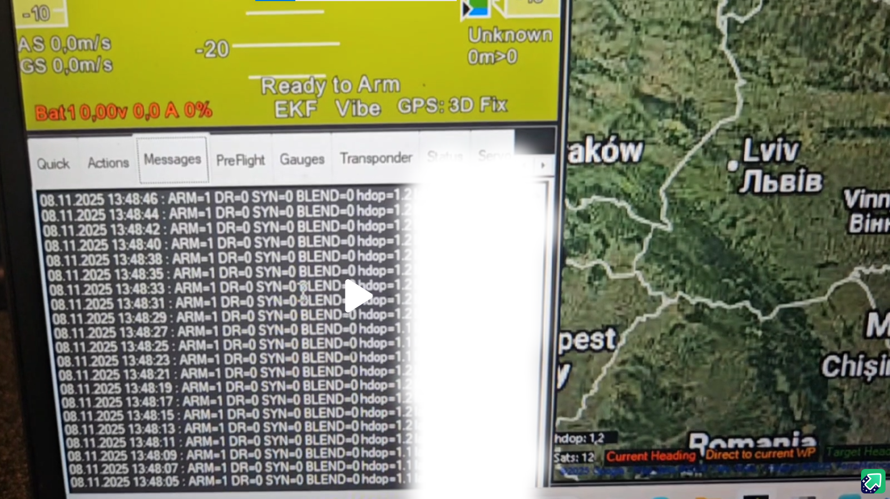

# Робота під час виконання

## DR0 vs DR1

- **DR0**: штатний режим. Передавання GNSS на GPS UART FC увімкнене.
- **DR1**: захисний режим. Передавання GNSS на GPS UART FC заблоковане.

Це не дозволяє підозрілим GNSS-даним потрапляти у навігаційний вхід FC, поки активний DR1.

## Тригери DR1 (поточна прошивка)

- No-fix або мало супутників (`sats < 5`) переводить у DR1 одразу (після стартового guard-вікна).
- Також DR1 можуть викликати перевірки стрибка позиції, висоти, SNR та EKF (залежно від параметрів).
- `EKF_TRIPMS=0` означає миттєвий EKF-тригер DR1 при невалідному EKF.

## Стартова затримка

- `BOOT_DLYMS` задає вікно після старту, протягом якого DR/EKF-тригери не переводять систему в DR1.
- Збільшуйте `BOOT_DLYMS`, якщо DR1 з'являється одразу після вмикання і зникає після reset.

## Діагностика пересилання GNSS

- `FCGPS_FWD=1` примусово вмикає пересилання навіть у DR1 (лише для діагностики).
- `FCGPS_FWD=0` - штатний anti-spoof режим.
- Поле логу `d=<fcgps_drop>/<gnss_drop>` показує втрати байтів при неблокуючому записі UART.

## Режим приймача

- `GNSS_TYPE=0`: режим u-blox/UBX.
- `GNSS_TYPE=1`: режим UM980/UM981 NMEA.
- Зміна `GNSS_TYPE` застосовується після перезавантаження STM32.

## Приклад логів (GCS)

Нижче приклад формату статусних повідомлень у GCS.

## Послідовність повернення з DR1

Коли умови rejoin виконані:

1. Запускається таймер стабільності rejoin.
2. За потреби відпрацьовує blend на `BLEND_MS`.
3. Фільтр виходить із DR1 і відновлює DR0.

## Вихід події DR1

- Пін: `B5`.
- Поведінка: високий рівень 3 секунди при кожному переході DR0 -> DR1, потім низький.
- Призначення: зовнішній логер/маяк/індикатор.

## Операційні перевірки

- Якщо FC постійно показує `No Fix`, перевірте, чи AUX-логіка RC не примусово вимикає GPS на FC.
- Якщо карта показує стрибки під час спуфінгу, орієнтуйтесь на стан DR і логи фільтра, а не на картографічну трасу.
