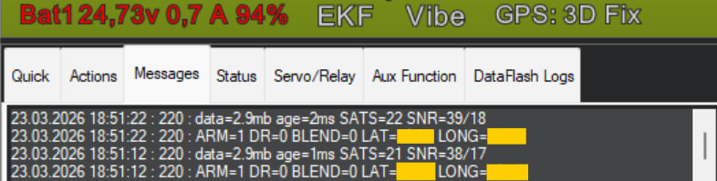

# Робота під час виконання

> Де купити плату: [GPS Spoofing Filter](https://airdroper.org/product/gps-spoofing-filter/)

## DR0 vs DR1

- **DR0**: штатний режим. Передавання GNSS на GPS UART FC увімкнене.
- **DR1**: захисний режим. Живе передавання GNSS на GPS UART FC заблоковане — FC отримує тишу.

Це не дозволяє підозрілим живим GNSS-даним потрапляти у навігаційний вхід FC, поки активний DR1.

### Діаграма станів

```
                    ┌──────────────────────────────────┐
                    │                                  │
                    ▼                                  │
              ┌──────────┐    guard trip         ┌──────────┐
   boot ────► │   DR0    │ ───────────────────►  │   DR1    │
              │ (normal) │    (position jump,    │ (protect)│
              │          │     no fix, SNR,      │          │
              │ GPS      │     EKF bad, etc.)    │ GPS      │
              │ forwarded│                       │ blocked  │
              └──────────┘  ◄─────────────────── └──────────┘
                    ▲         rejoin conditions:       │
                    │         • RJ_MIN_SATS met        │
                    │         • RJ_MAX_HD met          │
                    │         • RJ_STAB_MS held        │
                    │         • DR_LOCK_MS elapsed     │
                    │         • (optional) EKF OK      │
                    │                                  │
                    └──────────────────────────────────┘
                          rejoin guard (500 ms)
                          prevents immediate re-trip
```

## Тригери DR1 (поточна прошивка)

- No-fix або мало супутників (`sats < 5`) переводить у DR1 одразу (після стартового guard-вікна).
- Також DR1 можуть викликати перевірки стрибка позиції, висоти, SNR та EKF (залежно від параметрів).
- `EKF_TRIPMS=0` означає миттєвий EKF-тригер DR1 при невалідному EKF.
- Стрибок у південну півкулю: якщо широта GPS стає менше 0°, DR1 спрацьовує миттєво. Фільтр також блокує будь-яку позицію південної півкулі від потрапляння на FC (всі дрони працюють у північній півкулі).
- Порушення гео-огорожі (якщо `FENCE_RAD > 0`): позиція за межами радіусу (до 2000 км) від першого фіксу.
- Розворот курсу: зміна курсу >150° за 2 секунди при швидкості >5 м/с.
- Аномалія часу GPS: відхилення >2 с між часом GPS та внутрішнім годинником.
- Максимальна тривалість DR1 (`DR1_MAX_MS > 0`): автоматичний вихід з DR1 після заданого таймауту.

### Оцінка достовірності спуфінгу

Прошивка обчислює зважену оцінку (0–100) з до 8 сигналів виявлення. Бал видно в Mission Planner як `DR_CONF` і записується в кожен лог подій. Вищі значення означають більше ознак спуфінгу. Для приймачів UM980/NMEA недоступні UBX-сигнали пропускаються.

### Тільки UBX vs універсальне виявлення

Більшість сигналів працюють з обома приймачами. Наступні сигнали **тільки для u-blox**:

| Сигнал | Потрібне UBX повідомлення |
|--------|--------------------------|
| Стандартне відхилення pseudorange | NAV-SAT (поле prRes) |
| Різка зміна GDOP | NAV-DOP (поле gDOP) |
| Стрибок тактового зсуву | NAV-CLOCK (поле clkB) |

## Стартова затримка

- `BOOT_DLYMS` задає вікно після старту, протягом якого DR/EKF-тригери не переводять систему в DR1.
- Збільшуйте `BOOT_DLYMS`, якщо DR1 з'являється одразу після вмикання і зникає після reset.

## Діагностика пересилання GNSS

- `FCGPS_FWD=1` примусово вмикає живе пересилання навіть у DR1 (лише для діагностики).
- `FCGPS_FWD=0` — штатний anti-spoof режим.

## Режим приймача

- `GNSS_TYPE=0`: режим u-blox/UBX.
- `GNSS_TYPE=1`: режим UM980/UM981/UM982 NMEA.
- Зміна `GNSS_TYPE` застосовується після перезавантаження STM32.
- У `GNSS_TYPE=1` STM32 очікує один фізичний потік UM980 на `A2/A3` і пересилає цей самий потік на GPS UART FC.

## Приклад логів (GCS)

Нижче приклад формату статусних повідомлень у GCS.

- У вкладці Mission Planner `Messages` ці періодичні логи STM32-фільтра зазвичай з’являються приблизно раз на **10 секунд**.
- Зазвичай ви бачите два сусідні рядки:
  - рядок режиму/стану: `ARM=... DR=... BLEND=... LAT=... LONG=...`
  - рядок зведення GNSS: `data=... fix=... nav=... SATS=... SNR=...`
- `fix` — це вік останнього валідного позиційного/висотного фіксу; `nav` — вік останнього валідного GNSS nav-data кадру, який бачить фільтр.
- `SNR=NA` означає, що фільтр зараз не отримує придатні SNR-дані від приймача. Для u-blox це зазвичай означає, що приймач не видає `NAV-SAT`. Для UM980/981 — що не надходять речення `GSV`.
- Якщо `SNR_EN=1` і `SNR=NA` тримається понад 30 секунд, у GCS фіксується попередження `WARNING: SNR_EN=1 but SNR=NA/stale (no fresh GSV/NAV-SAT?)`. SNR-захист не може спрацювати, поки відсутні SNR-дані.



## Послідовність повернення з DR1

Коли умови rejoin виконані:

1. Запускається таймер стабільності rejoin.
2. За потреби відпрацьовує blend на `BLEND_MS`.
3. Фільтр виходить із DR1 і відновлює DR0 (пересилання GNSS).

## Вихід події DR1

- Пін: `B5`.
- Поведінка: високий рівень 3 секунди при кожному переході DR0 -> DR1, потім низький.
- Призначення: зовнішній логер/маяк/індикатор.

## Watchdog відновлення GNSS

Фільтр автоматично намагається відновити зупинений GNSS-приймач, якщо валідний фікс не отримано.

- Через **15 с** без фіксу: надсилається гарячий перезапуск.
- Через **45 с** без фіксу: надсилається холодний/заводський перезапуск.
- Кожні **120 с** після холодного перезапуску, якщо фікс досі відсутній: повторна спроба холодного перезапуску.
- Всі таймери скидаються одразу після отримання валідного фіксу.

**u-blox**: гарячий старт — UBX `CFG-RST` з `navBbrMask=0x0000`; холодний — `navBbrMask=0xFFFF`.

**UM980/981**: гарячий старт надсилає `RESET\r\n` на GNSS UART; холодний/заводський — `FRESET\r\n`.
Після `FRESET` STM32 чекає завершення boot приймача і повторно знаходить активну швидкість GNSS.

Повідомлення про відновлення логуються в GCS (`INFO` для гарячого, `WARNING` для холодного та повторів).

## Операційні перевірки

- Якщо FC постійно показує `No Fix`, перевірте, чи AUX-логіка RC не примусово вимикає GPS на FC.
- Якщо карта показує стрибки під час спуфінгу, орієнтуйтесь на стан DR і логи фільтра, а не на картографічну трасу.
